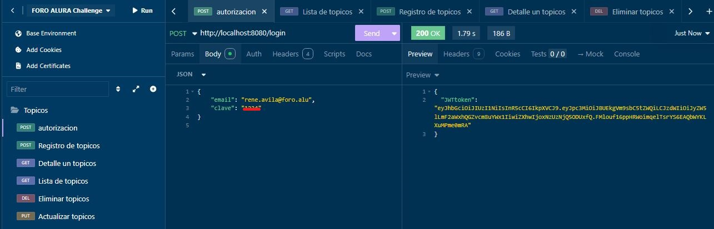

# Challenge Foro Alura by Rene Avila Alonso
Proyecto desarrollado durante el curso de la formación Avanzando con Java de Alura
para BackEnd

[Descripción proyecto](#descripción-proyecto) <br/>
[Como usar la API](#como-usar-la-api) <br/>
[Tecnologías utilizadas](#Tecnologías-utilizadas) <br/>
[Personas o entidades contribuyentes en el Proyecto](#Personas-o-entidades-contribuyentes-en-el-Proyecto) <br/>
[Desarrolladores del Proyecto](#Desarrolladores-del-Proyecto) <br/>

1. [Autorizacion](#autorizacion)
2. [Registrar usuarios desde MYSQL](#registrar-usuarios-desde-MYSQL)
3. [Registrar topicos](#registrar-topicos)
4. [Lista de topicos](#lista-de-topicos)
5. [Detalle de un topico](#detalle-de-un-topico)
5. [Eliminar un topcio](#eliminar-un-topico)
6. [Recuperar topico borrado](#recuperar-topico-borrado)
7. [Actualizar topicos](#actualizar-topicos)

<h2>**26-API REST FORO CHALLENGE ALURA**</h2>
<h3>Inicio</h3>
<em> MENU DE OPCIONES </em> <br/>
- - - - - - - - - - - - - - - - - - - - - - <br/>

NOTAS ANTES DE UTILIZAR EL PROYECTO </br>
* Utilizar una variable de entorno JWT_SECRET, con un numero de 4 a 8 cifras</br>
* o Colocar DB_NAME = db_foro_api, y en properties dejar DB_NAME </br>
* Se esta utilizando JDK 17, e Intellij IDEA </br>
* puede utilizar en variables de entorno DB_NAME, DB_PASSWORD, pero </br>
* hacer los cambios respectivos en Application.properties </br>
* </br>

<h2>Descripción proyecto</h2>
¡Te damos la bienvenida a nuestro más reciente Challenge Back End!

Un foro es un lugar donde todos los participantes de una plataforma
pueden colocar sus preguntas sobre determinados asuntos. Aquí en Alura, los estudiantes utilizan el foro para resolver sus dudas sobre los cursos y proyectos en los que están participando. Este lugar mágico está lleno de mucho aprendizaje y colaboración entre estudiantes, profesores y moderadores.

Ya sabemos para que sirve el foro y sabemos cómo se ve, pero ¿sabemos cómo funciona por detrás? Es decir ¿dónde se almacenan las informaciones? ¿cómo se tratan esos datos para que se relacione un tópico con una respuesta, o como se relacionan los usuarios con las respuestas de un tópico?

Ese es nuestro desafío, que se llama Foro Hub: vamos a replicar a nivel de back end este proceso, y para eso crearemos una API REST usando Spring.

Nuestra API va a centrarse específicamente en los tópicos, y debe permitir a los usuarios:

Crear un nuevo tópico
Mostrar todos los tópicos creados
Mostrar un tópico específico
Actualizar un tópico
Eliminar un tópico

Es lo que conocemos comúnmente como CRUD (CREATE, READ, UPDATE, DELETE).

Al final de nuestro desarrollo tendremos una API REST con las siguientes funcionalidades

API con rutas implementadas siguiendo las mejores prácticas del modelo REST;</br>
Validaciones realizadas según reglas de negocio;</br>
Implementación de una base de datos para la persistencia de la información;</br>
Servicio de autenticación/autorización para restringir el acceso a la información.<br/>

<h2>Como usar la API</h2> <br/> 
**FORO API ALURA**   <br/>
Generar token al Inicio de Sesion. <br/>



<h2>Grabar token en insomnia</h2>

</br>

[Inicio](#Inicio)

<h2>Listar libros registrados BD</h2> 
</br>
[Inicio](#Inicio)

<h2>Listar autores registrados BD</h2> 
```
Hibernate: SELECT nombre, year_born, year_dead FROM autores </br>
```
</br>
[Inicio](#Inicio)

<h2>Listar autores vivos en un determinado año BD</h2> 
</br>

[Inicio](#Inicio)

<h2>Listar autores fallecidos BD</h2>
</br>

[Inicio](#Inicio)

<h2>Listar libros por idioma BD</h2>
</br>
[Inicio](#Inicio)
<h2>Libros mas populares en la API GUTENDEX</h2>
</br>

[Inicio](#Inicio)

<h2>Buscar autor por nombre BD</h2>
</br>

[Inicio](#Inicio)

<h2>Tecnologías utilizadas</h2>
- Java <br/>
- Manejo de API GUTENDEX <br/>
- Postman  (para hacer las pruebas de la API) <br/>
- Editor IDE, Intellij IDEA <br/>
- git, github y terminal. <br/>
- LURI, IA de ALURA-ONE, Sao Pablo, Brazil. <br/>
- API, Exchangerate API. <br/>
- Gson, Api de Java, desarrollada por Google. <br/>
- plugins de Intellij IDEA, para mostrar README.md <br/>
- Trello (planeador de actividades a seguir de un proyecto) <br/>
- De Manejador de base de datos, ProgreSQL.  <br/>
- Administrador de bases de datos, PGADMIN-4 <br/>

[Inicio](#Inicio)

<h2>Personas o entidades contribuyentes en el Proyecto</h2>
- Alura LATAM, ONE(Oracle Next Education) <br/>
- Profesor. Bruno Dario Fernández Ellerbach <br/>
- Profesora. Genesys Rondón </br>
- Profesor. Eric Monné Fraga de Oliveira. <br/>

<h2>Desarrolladores del Proyecto</h2>
- René Avila Alonso. <br/>
- Desarrollador BackEnd <br/>
- July, 2025. </br>
  </br>
  [Inicio](#Inicio)
