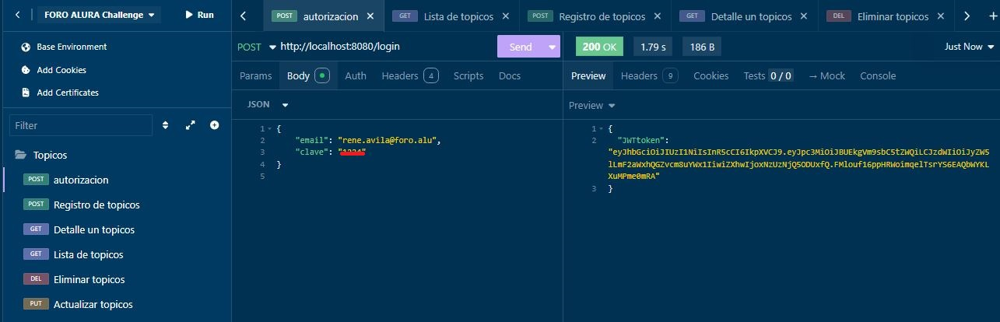

# Challenge Foro Alura by Rene Avila Alonso
Proyecto desarrollado durante el curso de la formación Avanzando con Java de Alura
para BackEnd
<h2>Inicio</h2>

[Descripción proyecto](#descripción-proyecto) <br/>
[Como usar la API](#como-usar-la-api) <br/>
[Tecnologías utilizadas](#Tecnologías-utilizadas) <br/>
[Personas o entidades contribuyentes en el Proyecto](#Personas-o-entidades-contribuyentes-en-el-Proyecto) <br/>
[Desarrolladores del Proyecto](#Desarrolladores-del-Proyecto) <br/>

1.- [Autorización](#autorización) <br/>
2.- [Registrar usuarios desde MYSQL](#registrar-usuarios-desde-mysql) <br/>
3.- [Registrar topicos](#registrar-topicos) <br/>
4.- [Grabar variable ambiente en Insominia](#grabar-variable-ambiente-en-insominia) <br/>
5.- [Lista de topicos](#lista-de-topicos) <br/>
6.- [Detalle de un topico](#detalle-de-un-topico) <br/>
7.- [Eliminar un topcio](#eliminar-un-topico) <br/>
8.- [Recuperar topico borrado](#recuperar-topico-borrado) <br/>
9.- [Actualizar topicos](#actualizar-topicos) <br/>

<h2>**26-API REST FORO CHALLENGE ALURA**</h2>

NOTAS ANTES DE UTILIZAR EL PROYECTO </br>
* Utilizar una variable de entorno JWT_SECRET, con un numero de 4 a 8 cifras</br>
* o Colocar DB_NAME = db_foro_api, y en properties dejar DB_NAME </br>
* Se esta utilizando JDK 17, e Intellij IDEA </br>
* puede utilizar en variables de entorno DB_NAME, DB_PASSWORD, pero </br>
* hacer los cambios respectivos en Application.properties </br>
* Tener creada la base de datos o esquema en MySql, db_foros_api</br>

<h2>Descripción proyecto</h2>
¡Te damos la bienvenida a nuestro más reciente Challenge Back End! </br>

Un foro es un lugar donde todos los participantes de una plataforma
pueden colocar sus preguntas sobre determinados asuntos. Aquí en Alura, 
los estudiantes utilizan el foro para resolver sus dudas sobre los cursos 
y proyectos en los que están participando. Este lugar mágico está lleno de 
mucho aprendizaje y colaboración entre estudiantes, profesores y moderadores.</br>

Ya sabemos para que sirve el foro y sabemos cómo se ve, pero ¿sabemos cómo 
funciona por detrás? Es decir ¿dónde se almacenan las informaciones? 
¿cómo se tratan esos datos para que se relacione un tópico con una respuesta, 
o como se relacionan los usuarios con las respuestas de un tópico?</br>

Ese es nuestro desafío, que se llama Foro Hub: vamos a replicar a nivel de 
back end este proceso, y para eso crearemos una API REST usando Spring.</br>

Nuestra API va a centrarse específicamente en los tópicos, y debe permitir a 
los usuarios:</br>

* Crear un nuevo tópico</br>
* Mostrar todos los tópicos creados</br>
* Mostrar un tópico específico</br>
* Actualizar un tópico</br>
* Eliminar un tópico</br>

Es lo que conocemos comúnmente como CRUD (CREATE, READ, UPDATE, DELETE).</br>

Al final de nuestro desarrollo tendremos una API REST con las siguientes 
funcionalidades:</br>

API con rutas implementadas siguiendo las mejores prácticas del modelo REST;</br>
Validaciones realizadas según reglas de negocio;</br>
Implementación de una base de datos para la persistencia de la información;</br>
Servicio de autenticación/autorización para restringir el acceso a la información.<br/>

<h2>Como usar la API</h2> 
</br> 
[Inicio](#inicio)
</br>
<h3>Generar token al Inicio de Sesion</h3>. <br/>
<h3>Autorización</h3> 
</br>
<STRONG>{POST} http://localhost:8080/login</STRONG>
</br>
 
</br>
[Inicio](#inicio)
</br>

<h2>Registrar usuarios desde MYSQL</h2>
</br>
<STRONG>{POST} http://localhost:8080/topicos</STRONG>
</br>

</br>
[Inicio](#inicio)
</br>
Entre a:
```
https://bcrypt-generator.com/
```
Genere una clave encryptada de 4 a 8 digitos y grabar un usuario
con id, nombre, email, clave, activo desde MYSQL. 

Si necesita insertar registros en MySql, lo puede hacer por:
* MySql Line Clent (Esta opcion esta disponible cuando instala MYSQL WORKBENCH)
* Desde MySql Workbench, crear un query y coloque la siquiente sentencia:
```commandline
use db_foros_api;
```
La base de datos db_foros_api ya debe estar creada, esto lo hace 
la migracion con flyway automaticamente.

Grabe algunos registros en la tabla usuarios:
```commandline
use db_foros_api;
INSERT INTO `usuarios` VALUES (1,'nombre usuario 1','pedro.usuario@foro.alu','$2y$10$RNFOk3Gz7C2PrQ1knGljPu93NhpX4SIX.Dap3Vi5EGwrIvMmCSWby',1);
INSERT INTO `usuarios` VALUES (2,'nombre usuario 2','maria.apellido@voll.med','$2y$10$IJdVIrFRyH88UK1XiuPQbuSxMBFb1Pg7z54jTNtXZwtuYnqW10eQq',1);
```
<h2>Grabar token en insomnia</h2>
Primero generar token en Autorización, luego busque BASE ENVIRONMENT
cree una variable "bearer":"aqui coloque el token generado"
</br>
```commandline
[POST] http://localhost:8080/login
```

</br>
[Inicio](#inicio)

<h2>Grabar variable ambiente en Insominia</h2> </br>

</br>
[Inicio](#inicio)

<h2>Registrar topicos</h2>
</br>
<STRONG>{POST} http://localhost:8080/topicos</STRONG>
</br>

</br>
[Inicio](#inicio)

<h2>Lista de Topicos</h2> </br>
</br>
<STRONG>{GET} http://localhost:8080/topicos</STRONG>
</br>

</br>
[Inicio](#inicio)

<h2>Detalle de un topico</h2> </br>
</br>
<STRONG>{GET} http://localhost:8080/topicos/2</STRONG>
</br>
Para este caso esta listando el topico con id=2 </br>

</br>
[Inicio](#inicio)

<h2>Eliminar un topico</h2> </br>
</br>
<STRONG>{DELETE} http://localhost:8080/topicos/3</STRONG>
</br>
Elimina el topico con id=3 </br>

</br>
[Inicio](#inicio)

<h2>Recuperar topico borrado</h2> </br>
</br>
<STRONG>{PUT} http://localhost:8080/topicos/recupera/2</STRONG>
</br>
Recupera por borrado logico, el id=2 de topicos

[Inicio](#inicio)

<h2>Actualizar topicos</h2> </br>
</br>
<STRONG>{PUT} http://localhost:8080/topicos/4</STRONG>
</br>
Para este ejemplo edita y actualiza el topico con id=4 </br>

<h2>Tecnologías utilizadas</h2>
- Java, sprint boot<br/>
- Insomina o Postman  (para hacer las pruebas de la API) <br/>
- Editor IDE, Intellij IDEA <br/>
- git, github y terminal. <br/>
- LURI, IA de ALURA-ONE, Sao Pablo, Brazil. <br/>
- plugins de Intellij IDEA, para mostrar README.md <br/>
- Trello (planeador de actividades a seguir de un proyecto) <br/>
- De Manejador de base de datos, MYSQL WORKBENCH <br/>
- Administrador de bases de datos, MYSQL COMMAND LINE CLIENT<br/>

</br>
[Inicio](#inicio)

<h2>Personas o entidades contribuyentes en el Proyecto</h2>
- Alura LATAM, ONE(Oracle Next Education) <br/>
- Profesora. Genesys Rondón </br>
- Profesor. Bruno Dario Fernández Ellerbach <br/>
- Profesor. Eric Monné Fraga de Oliveira. <br/>

<h2>Desarrolladores del Proyecto</h2>
- René Avila Alonso. <br/>
- Desarrollador BackEnd <br/>
- July, 2025. </br>
  </br>
</br>
[Inicio](#inicio)
